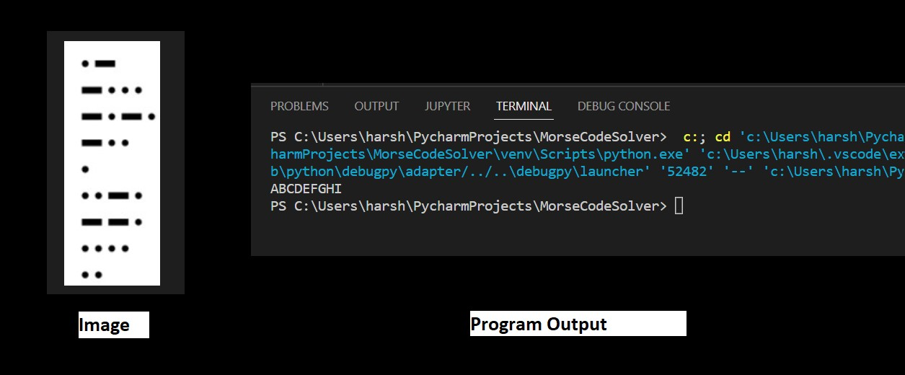
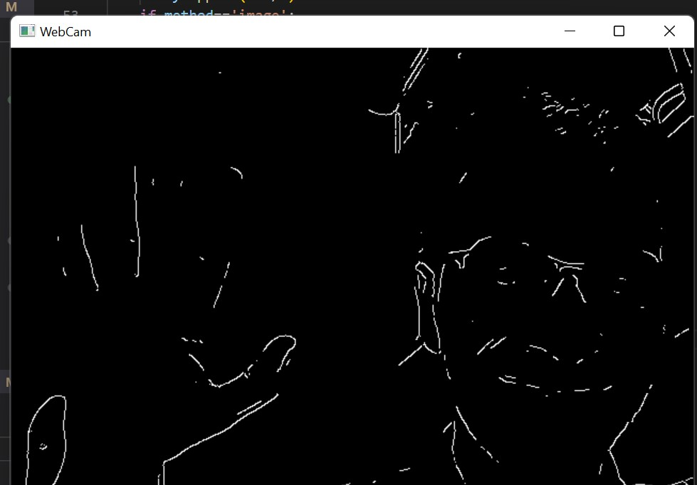
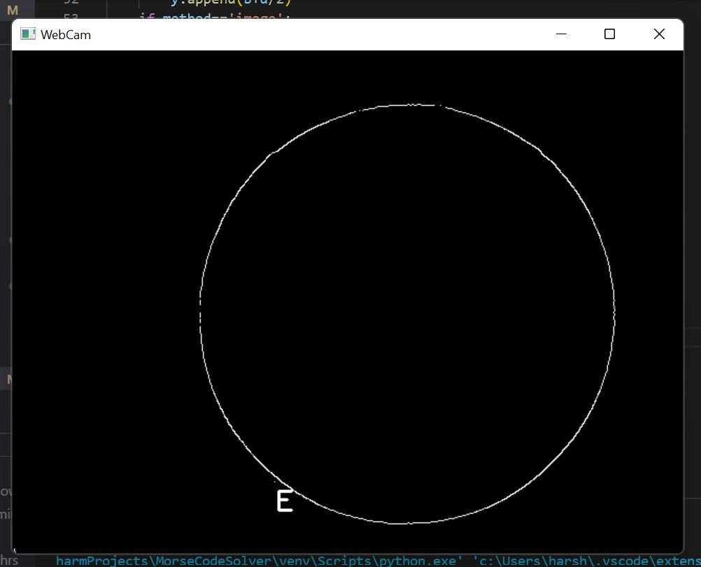

# Morse Code Solver


<br/>
<br/>


<!-- ABOUT THE PROJECT -->
## **About The Project**
This project aims to provide a valuable at


<br/>
<br/>


### **Tech Stack used**

* [Python](https://www.python.org/)
* [Open CV](https://opencv.org/)

<br/>

## **Key features**
1. Display morse code inside an image on terminal in english
2. Convert live video so that only the contors are visible
2. Display morse code inside an live video (from webcam) and overlay it with its english translation


### **Installation and Working**
Python must be installed on your system if running locally.

1. Clone the repo
   ```sh
   git clone https://github.com/Harsh-159/Morse-Code-Solver.git
   ```

2. Install open cv
   ```sh
   pip install opencv-python
   ```
3. For image save image in resouses folder and change line 98 to 
   ```sh
   img=cv2.imread('Resources/image_name.jpg')
   ```
   by default its set to alphabet.jpg which contains A to I in morse code
4. Run the code and get output text in terminal

5. For live webcam translation un-comment line 81 to 95 and comment the later section and run

<br/>

## **Screenshots**
<div align="center" ><br/>
Image to text<br/><hr width=600/>
  <br/><br/>
Display of only contors in the video<br/><hr width=600/>
  <br/><br/>
Video converting simple circle and displaying E i.e english version of morse code . <br/><hr width=600/>
  <br/><br/>
</div>
<br/>


<!-- CONTACT -->
### **Contact**
Harsh Yadav - harshyadavhappy@gmail.com

<br/>
